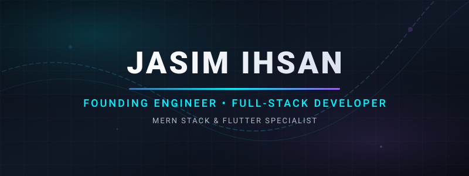

  

<h1 align="center">Jasim Ihsan</h1>

  

  &nbsp;&nbsp;
  &nbsp;&nbsp;
  &nbsp;&nbsp;
  

---

## 🚀 About Me

<table width="100%">
  <tr>
    <td width="55%" valign="top">
      

        I am a passionate <strong>Software Development Engineer</strong> dedicated to architecting and building highly scalable web applications, robust backend systems, and seamless cross-platform mobile experiences.
      

      

        My expertise spans the entire development lifecycle—from conceptualizing clean database schemas to deploying optimized production environments. I prioritize writing type-safe, maintainable code and optimizing runtime performance.
      

    </td>
    <td width="5%"></td>
    <td width="40%" valign="top">
      <h4>🎯 Focus Areas</h4>
      <ul>
        <li><strong>Scalable Backends:</strong> Node.js, Express, NestJS</li>
        <li><strong>Databases:</strong> PostgreSQL, MongoDB, Redis</li>
        <li><strong>Real-time Architecture:</strong> Socket.io & WebSockets</li>
        <li><strong>DevOps & CI/CD:</strong> Docker, AWS, GitHub Actions</li>
      </ul>
    </td>
  </tr>
</table>

---

## Experience

### Ciltriq Technologies

**Software Development Engineer** • 2025 — Present

- Built scalable web and mobile applications
- Developed secure backend APIs and authentication systems
- Worked on real-time communication and performance optimization

### Onboard

**Software Development Engineer** • 2025 — Present

- Developed recruitment and workforce management platforms
- Built PostgreSQL + Prisma backend systems
- Managed deployment workflows and production infrastructure

### ExpertX Coding Academy

**Technical Mentor** • 2025 — 2026

- Mentored students in MERN stack and Flutter
- Conducted live coding and architecture sessions

---

## Tech Stack

| Category     | Technologies                                                                                                                    |
| :----------- | :------------------------------------------------------------------------------------------------------------------------------ |
| **Frontend** |  |
| **Backend**  |    |
| **Mobile**   |                                   |
| **Database** |                       |
| **DevOps**   |            |

---

## Featured Projects

### Onboard Careers

Maritime recruitment platform built with scalable backend architecture.

**Stack:**    

🔗 https://www.onboardcareers.in

---

### NearHirable

Developer assessment platform with skill analysis workflows.

**Stack:**   

🔗 https://forge.onboardcareers.in

---

### MentorsHub

Real-time mentorship platform with chat, video calls, and payments.

**Stack:**    

🔗 https://mentors-hub-in.vercel.app

<!-- ---   -->

<!-- ## GitHub Stats

  

 -->

---

## Contact

- Portfolio → https://jasimihsan.in
- LinkedIn → https://linkedin.com/in/jasimihsan
- Email → jasimihsan1234@gmail.com
